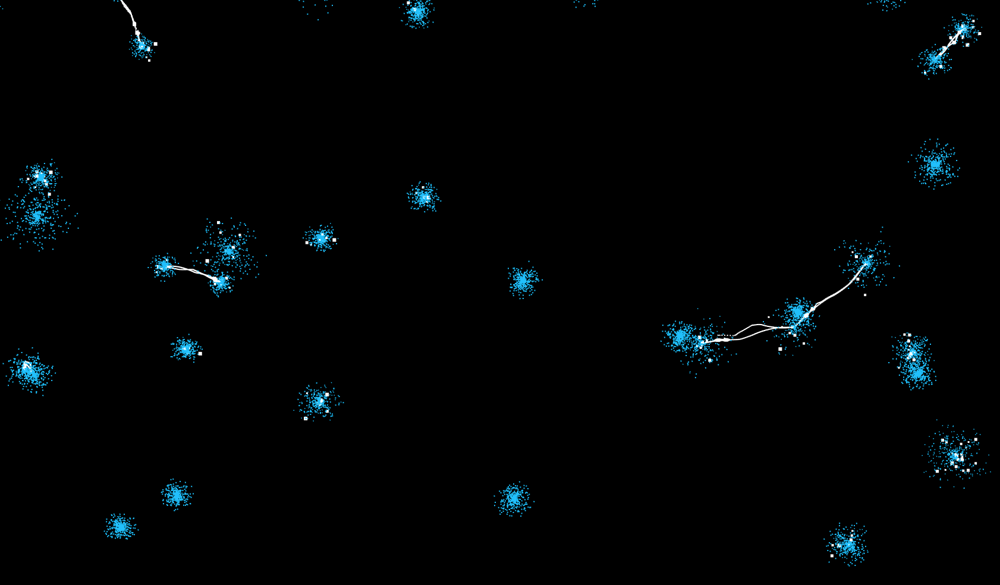
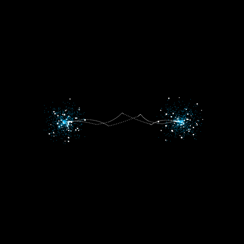
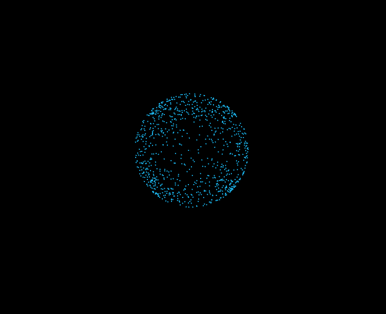
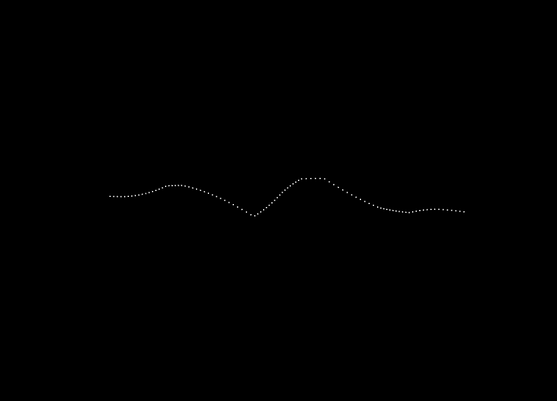
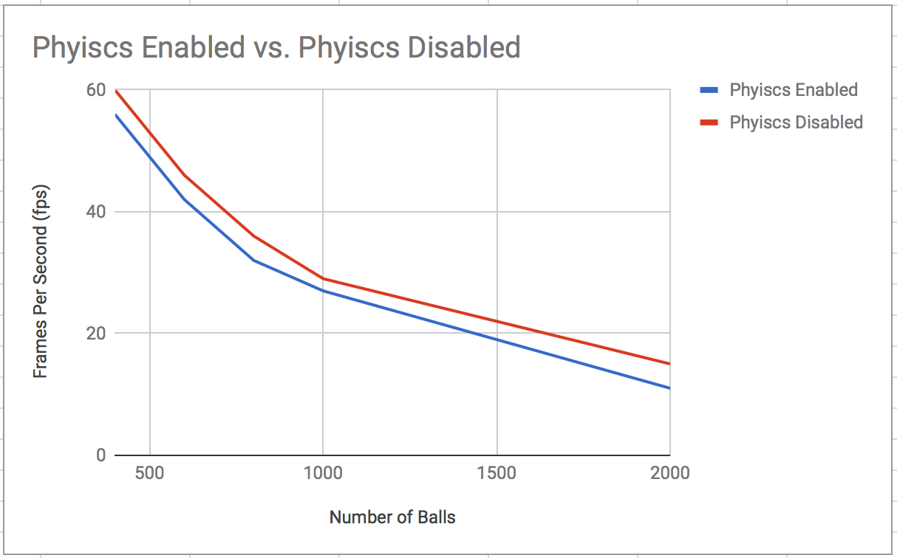
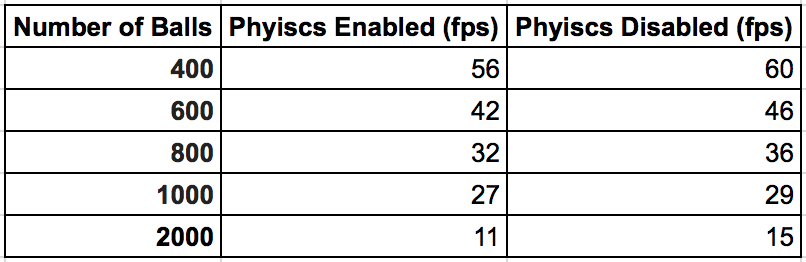
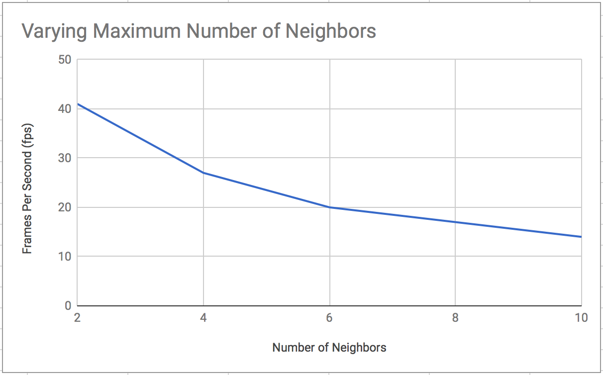
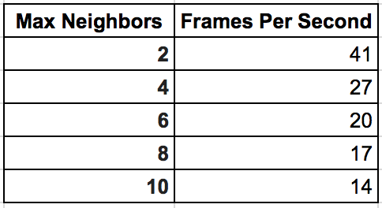

Particle Discharge
======================

**University of Pennsylvania, CIS 565: GPU Programming and Architecture, Final Project**

* Mohamed Soudy
* Tested on: **Google Chrome 63.0.3239.84 (Official Build) (64-bit)**
  macOS Sierra 10.12.6, i7-3720QM @ 2.70GHz 16GB, GT 650M 1024 MB (Personal Computer)

## Live Online

## Demo GIF

## Overview

This project implements static discharge between neighboring spheres using particles with **WebGL 2**. The goal of the project 
is to simulate hundreds of balls and see how they interact when they are near one another.

## Technique

### Particle Simulation

Everything in the scene is simulated using particles. Each particle is directed mainly using position, velocity, acceleration and mass attributes.
They follow the typical steering behavior of agents. I keep track of the particle attributes using transform feedback.

#### Ball

Every ball has a set of particles or "charges" assigned to it. These particles are discharged when they are near other charged balls.
Currently, 100 particles are used for the creation of each bolt and every ball has a maximum number of particles assigned to it 
which limit the number of neighbors it can have. For example, if a ball has 500 particles, it can only connect with 5 other balls 
through electrostatic discharge.

I use the idle particles to simulate the shape of the ball. I use the initial randomized positions of the particles as the direction vector
and multiply it by a factor and use that as the new position as depicted in the image below.

#### Bolt

I currently simulate each bolt using 100 particles. To mimic the shape of a bolt I used a combination of triangle waves, sin waves and cos waves applied
with different parameter on the particles x, y and z position. To align the particles along the line that connects both balls. I first assign an index value for each particle from 0 to 99. I then use this value to linearly interpolate between the particle's current ball position and the neighboring ball's position. 

I alternate between for different variants of the bolts with time to make it appear more random. Below is an example of a bolt created using particles.

### Clusters

I determine the location of each ball by making uses of clusters. The grid is divided into clusters where for each cluster
I store the number of balls inside it and the indices of the balls into a texture. That way I'll be able to do neighbor searching in
vertex shader. The image below shows how the grid is divided into clusters. To simplify the math, each cluster is of size 1 x 1 x 1 in world space. 

### Neighbor Search

For neighbor searching, I first store the data for the ball positions into a texture. This allows me to read the attributes of any ball in the scene.
For each particle, I determine which cluster it is in by just flooring its position. I then check all the neighbors of the current cluster which are 1 cluster size away, totaling to 27 clusters. I read the cluster texture for each of the neighboring clusters and check if they contain any balls. If they do contain any, I loop through the ball indices from the cluster texture and get the ball attributes using the balls texture. After which, I can check the distance between the current ball and the neighboring ball to determine if its close enough for the static charge to be discharged.

## Performance Analysis

I compared the performance of setting particle positions directly instead of using steering behavior. There was a performance boost however it wasn't great
as shown in the chart below. That is probably because I'm using the same shaders with transform feedback buffers. Since I no longer need to keep track of the particle pervious positions or velocities since they're all determined by the ball and texture buffers I no longer need to use transform feedback.

Increasing the maximum number of neighbors allowed per ball impacts performance.
This happens because for every single addition to the maximum number of neighbors, balls hold 100 more particles.

## Install instructions

1 - In the root directory of project, run `npm install`, to download all dependencies.

2 - Run `npm run start:dev` and then go to `localhost:8080` in your web browser.

## Credits

* [Three.js](https://github.com/mrdoob/three.js) by [@mrdoob](https://github.com/mrdoob) and contributors
* [stats.js](https://github.com/mrdoob/stats.js) by [@mrdoob](https://github.com/mrdoob) and contributors
* [glMatrix](https://github.com/toji/gl-matrix) by [@toji](https://github.com/toji) and contributors
* [primitive-icosphere](https://github.com/glo-js/primitive-icosphere) by [@mattdesl](https://github.com/mattdesl) 
* [spectorjs](https://github.com/BabylonJS/Spector.js) by [@BabylonJS](https://github.com/BabylonJS)
* [dat-gui](https://github.com/dataarts/dat.gui) by [@dataarts](https://github.com/dataarts)
